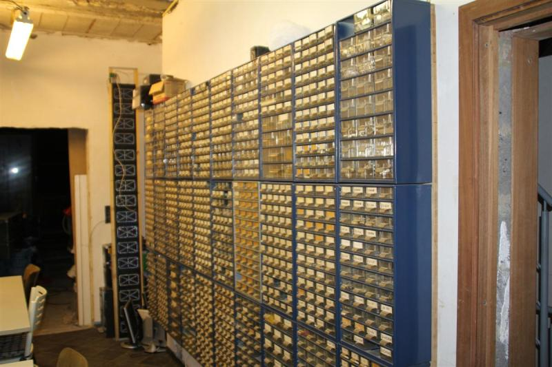

Hackerspaces: apprentissage par la pratique et mains dans le camboui
====================================================================

En pédagogie, l'apprentissage par la pratique est obtenu par les élèves grâce à leur propre expérience.

Cela contraste avec les apprentissages scolaires par transmission directe (maître à élève) ou indirecte (manuel scolaire, CDrom, video vers l'apprenant).

Dans l'apprentissage par la pratique, il est essentiel que l'expérience soit une relation à double sens, où l'étudiant d'une part, est actif par rapport au monde autour de lui.

Mais d'autre part, il doit assumer lui-même les conséquences de ses propres priorités, décisions et actions.

Un hackerspace est un tiers-lieu où des gens avec un intérêt commun (souvent autour de l'informatique, de la technologie, des sciences, des arts…) peuvent se rencontrer et collaborer.

Slides
======

## HSBXL and Norbert

## HSBXL

## Electronics

## Scanbot

## Learn by doing

## Learning pyramid

## Samsung Chord SDK and ZeroMQ

## ZeroMQ, the lightweight messaging library

## Zyre, an open-source framework for proximity-based peer-to-peer applications

## Glinet AR150, the router of choice

## Hardware vending machine at Revspace.nl

## Midicast at ZMQ hackaton

## Midicast at FOSDEM

Liens
=====

* https://www.educode.be/journee-principale/hackerspaces-apprentissage-par-la-pratique-et-mains-dans-le-camboui/
